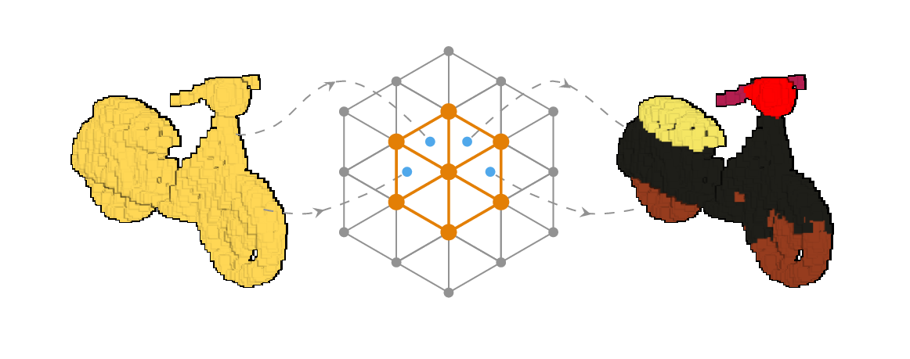
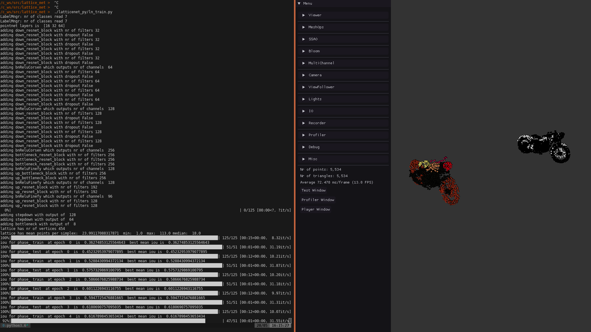
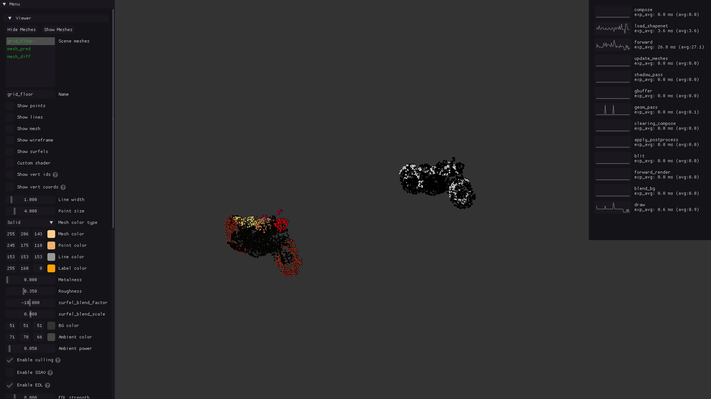

# LatticeNet 

<p align="middle">
  
</p>

This is the official PyTorch implementation of [LatticeNet: Fast Point Cloud Segmentation Using Permutohedral Lattices](https://arxiv.org/abs/1912.05905) 

LatticeNet can process raw point clouds for semantic segmentation (or any other per-point prediction task). The implementation is written in CUDA and PyTorch. There is no CPU implementation yet.

# Getting started 

### Install

The easiest way to install LatticeNet is using the included dockerfile. <br/>
You will need to have Docker>=19.03 and nvidia drivers installed. <br/>
Afterwards, you can build the docker image which contains all the LatticeNet dependencies using: 

```sh
$ git clone --recursive https://git.ais.uni-bonn.de/rosu/lattice_net.git 
$ cd lattice_net/docker
$ ./build.sh lattice_img #this will take some time because some packages need to be build from source
$ ./run.sh lattice_img 
$ git clone --recursive https://github.com/RaduAlexandru/easy_pbr
$ cd easy_pbr && make && cd ..
$ git clone --recursive https://github.com/RaduAlexandru/data_loaders  
$ cd data_loaders && make && cd ..
$ git clone --recursive https://github.com/RaduAlexandru/lattice_net
$ cd lattice_net && make && cd ..
```

### Data 

LatticeNet uses point clouds for training. The data is loaded with the [DataLoaders] package and interfaced using [EasyPBR]. Here we show how to train on the ShapeNet dataset.<br/>
While inside the docker container ( after running ./run.sh lattice_img ), download and unzip the ShapeNet dataset: 

```sh
$ bash ./lattice_net/data/shapenet_part_seg/download_shapenet.sh
```

# Usage

### Train 

LatticeNet uses config files to configure the dataset used, the training parameters, model architecture and various visualization options.<br/>
The config file used to train on the shapenet dataset can be found under "lattice_net/config/ln_train_shapenet_example.cfg".<br/>
Running the training script will by default read this config file and start the training.

```sh
$ ./lattice_net/latticenet_py/ln_train.py
```

### Configuration options 

Various configuration options can be interesting to check out and modify. We take ln_train_shapenet_example.cfg as an example. 

```
core: hdpi: false          #can be turned on an off to accomodate high DPI displays. If the text and fonts in the visualizer are too big, set this option to false
train: with_viewer: false  #setting to true will start a visualizer which displays the currently segmented point cloud and the difference to the ground truth
``` 
<br/><br/>
If training is performed with the viewer enabled, you should see something like this:
<br/>
<p align="middle">
  <!--  -->
  
  <!-- <figcaption> Your text </figcaption> -->
  <!--   -->
  <!--   -->
  <!--   -->
  <!-- <figcaption> Your text </figcaption> -->
  <!--  -->
  <!--  -->
</p>


<!-- ### Dependencies 
```sh
$ sudo python3 -m pip install  --verbose --no-cache-dir  torch-scatter==1.4.0 
```
You will also need to install both [EasyPBR] and [DataLoaders] with the intructions on the respective pages.


### Build and install: 
```sh
$ git clone --recursive https://git.ais.uni-bonn.de/rosu/lattice_net.git
$ cd lattice_net
$ make
```

### Training 
For training start the script: 
```sh
$ latticenet_py/lnn_train.py 
``` -->

   [EasyPBR]: <https://github.com/RaduAlexandru/easy_pbr>
   [DataLoaders]: <https://github.com/RaduAlexandru/data_loaders>


